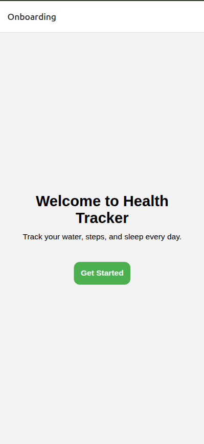
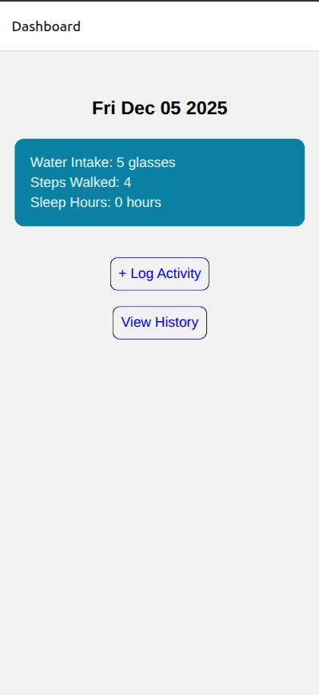
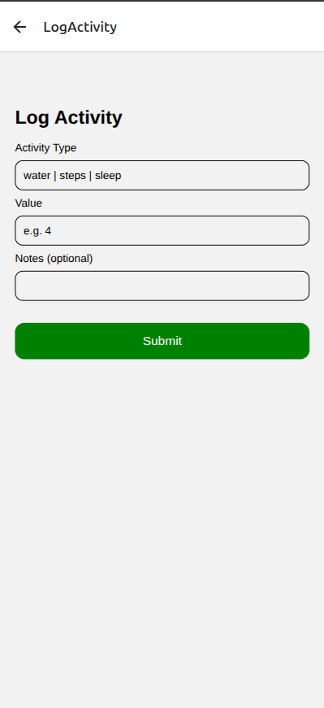
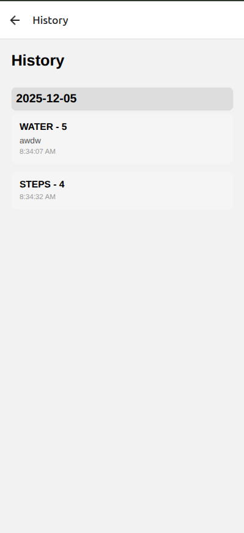

# 📱 FitTrack – Personal Health Tracker App

A simple and intuitive React Native + Expo application that helps users track their daily water intake, steps walked, and sleep hours, with activity history stored locally using AsyncStorage.

This project was built as part of a React Native internship assignment.

You can download and test the app here:

👉 https://expo.dev/accounts/meet2306/projects/personal-health-tracker/builds/fc766531-e445-4a6f-8b08-cb18e8cd55f6

---

## 📱 Screenshots

### Onboarding Screen

### Dashboard Screen

### LogActivity Screen

### History Screen

---

## 🚀 Features

### Onboarding Screen

- Clean welcome UI

- Button to enter the app

### Dashboard

- Shows today’s date

- Summary cards for:
  - Water intake
  - Steps walked
  - Sleep hours

- Quick action buttons to add activity entries

### Log Activity Screen

- Add activity with:
  - Type (water, steps, sleep)
  - Value
  - Time (auto-filled)
  - Optional notes

- Proper validation

- Stores data inside AsyncStorage

### History Screen

- Shows logged activities from the last 7 days

- Grouped by date

- Pull-to-refresh support

- Clean UI with date headers

---

## 🏛 Tech Stack

- React Native

- Expo

- AsyncStorage (for local storage)

- React Navigation for screen transitions

---

## 💾 Local Storage Logic

### saveActivity(activity)

- Fetch old array → push new entry → save again

- Ensures persistent local storage

### getActivities()

- Returns all saved activities

### getActivitiesLast24Hours()

- Filters activities within the last 24 hours

### getLast7Days()

- Filters activities within the last 7 days